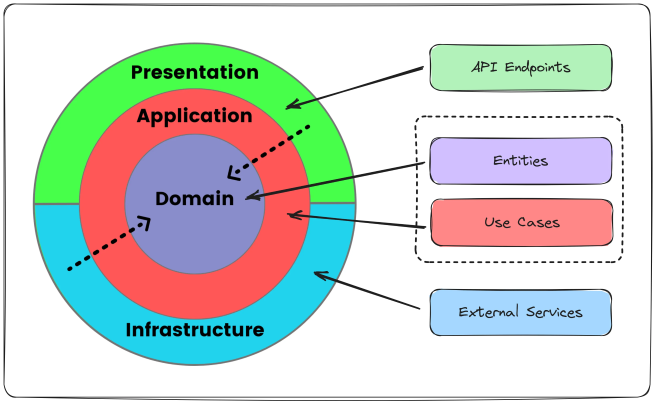

# Substitutiva Fiap - Fase 3

- [Substitutiva Fiap - Fase 3](#tech-challenge-fiap---fase-1)
    - [Como rodar?](#como-rodar)
    - [Arquitetura](#arquitetura)
    - [Estrutura de pastas](#estrutura-de-pastas)

## Como rodar?

Para rodar, basta ter o Docker instalado em sua máquina e rodar o seguinte comando:

```shell
docker compose up -d
```

Após a execução do comando acima, será possível acessar o Swagger por meio do endpoint:

http://localhost:8080/swagger-ui/index.html

## Arquitetura

Para o desenvolvimento do projeto, foi utilizado a Arquitetura Clean Architecture.


Fonte: https://blog.stackademic.com/design-application-using-clean-architecture-9ff7ccad79bb

## Estrutura de pastas

```
.
└── src/
    ├── application/
    │   └── services
    ├── domain/
    │   └── entities
    ├── infrastructure/
    │   └── repositories
    └── presentation/
        └── controllers
```